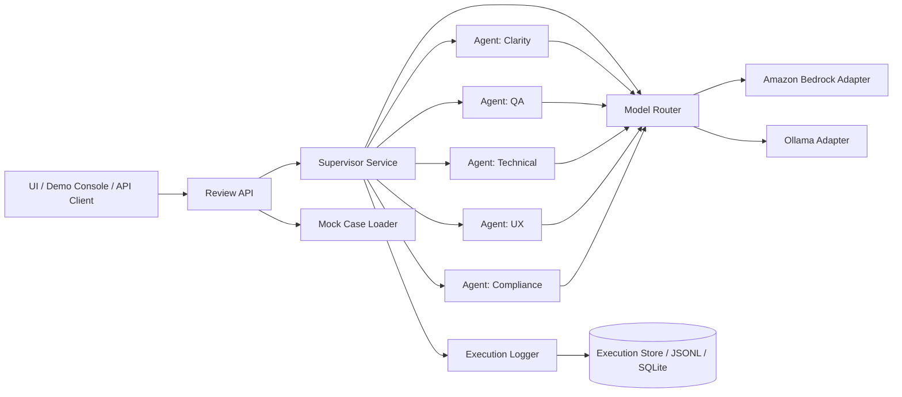
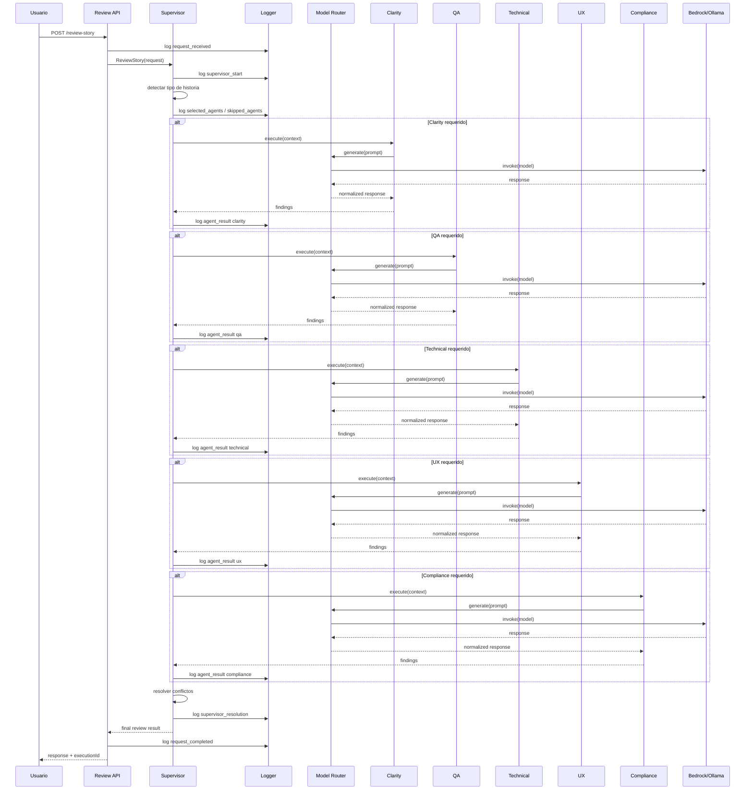

# Arquitectura Tecnica
## POC Multiagente de Revision de Historias y Requerimientos

## 1. Vision general

La arquitectura se basa en un **supervisor central**, varios **agentes especializados**, una capa de **abstraccion del proveedor LLM** y un modulo de **observabilidad/logging**.

La meta es permitir que una misma ejecucion use **Amazon Bedrock** o **Ollama** sin cambiar la logica de negocio ni el contrato entre supervisor y agentes.

---

## 2. Principios de diseno

- **Especializacion**: cada agente resuelve una dimension distinta.
- **Seleccion dinamica**: no todos los agentes se ejecutan siempre.
- **Trazabilidad**: toda decision importante queda logueada.
- **Abstraccion de proveedor**: Bedrock y Ollama comparten interfaz.
- **Salida estructurada**: cada agente responde en JSON controlado.
- **Simplicidad de POC**: arquitectura clara, sin complejidad innecesaria.

---

## 3. Diagrama de componentes



---

## 4. Componentes principales

## 4.1 UI / Demo Console
Puede ser:

- una consola;
- una pagina web simple;
- un endpoint consumido con Postman.

Responsabilidades:
- ingresar historia;
- elegir proveedor y modelo;
- disparar ejecucion;
- ver resultado;
- ver log.

---

## 4.2 Review API
Expone endpoints para:

- revisar una historia;
- consultar resultados;
- consultar logs;
- correr casos mock.

No contiene logica analitica; solo orquesta entrada/salida y delega al supervisor.

---

## 4.3 Supervisor Service
Es el componente principal de negocio.

Responsabilidades:

- inspeccionar la historia;
- inferir categorias;
- decidir agentes a invocar;
- pasar contexto compartido;
- comparar salidas;
- resolver tensiones;
- construir la respuesta final;
- emitir eventos de logging.

---

## 4.4 Agentes especializados
Cada agente es un componente autonomo que:

- recibe input normalizado;
- genera prompt contextual;
- invoca el proveedor LLM elegido;
- devuelve salida estructurada;
- registra mensajes y resultados.

Agentes previstos:
- ClarityAgent
- QaAgent
- TechnicalAgent
- UxAgent
- ComplianceAgent

---

## 4.5 Model Router
Abstrae la seleccion del proveedor/modelo.

Responsabilidades:
- recibir la configuracion de ejecucion;
- resolver si se usa Bedrock u Ollama;
- instanciar el cliente correspondiente;
- normalizar request/response.

### Contrato conceptual

```text
Supervisor/Agent -> ModelRouter -> ProviderAdapter -> LLM
```

---

## 4.6 Amazon Bedrock Adapter
Encapsula la comunicacion con Bedrock.

Responsabilidades:
- usar credenciales/región AWS;
- invocar el modelo configurado;
- mapear request/response al formato interno;
- reportar tiempos y errores.

Campos tipicos de configuracion:
- provider = bedrock
- region
- modelId
- temperature
- maxTokens

---

## 4.7 Ollama Adapter
Encapsula la comunicacion con el runtime local de Ollama.

Responsabilidades:
- llamar al endpoint local;
- enviar prompt y parametros;
- recibir y normalizar la salida;
- reportar tiempos y errores.

Campos tipicos de configuracion:
- provider = ollama
- endpoint
- model
- temperature
- numPredict

---

## 4.8 Execution Logger
Registra la secuencia completa de la ejecucion.

Debe poder persistir eventos como:
- request recibido;
- decision del supervisor;
- agente invocado;
- prompt emitido;
- respuesta recibida;
- agente omitido;
- conflicto detectado;
- consolidacion final.

Para un POC puede persistirse en:
- archivos JSONL;
- SQLite;
- memoria + exportacion a archivo.

---

## 4.9 Mock Case Loader
Permite cargar historias predefinidas para demo.

Responsabilidades:
- exponer lista de casos;
- devolver el texto de una historia;
- sugerir agentes esperados;
- facilitar demos repetibles.

---

## 5. Flujo de secuencia



---

## 6. Seleccion de agentes

La seleccion debe hacerse antes de invocar modelos para optimizar costo y claridad.

### Señales que puede usar el supervisor

- presencia de verbos de UI:
  - mostrar,
  - pantalla,
  - boton,
  - formulario,
  - perfil;
- presencia de terminos tecnicos:
  - retry,
  - scheduler,
  - cola,
  - integracion,
  - notificacion,
  - persistencia;
- presencia de datos sensibles:
  - datos personales,
  - documento,
  - reporte,
  - transacciones,
  - auditoria;
- baja complejidad:
  - cambio de texto,
  - renombrar label,
  - ajustar copy.

---

## 7. Estrategia de modelos

## 7.1 Modo simple recomendado
Una ejecucion usa un solo proveedor y un solo modelo.

Ventajas:
- facil de explicar;
- mas simple de implementar;
- resultados mas comparables.

## 7.2 Modo futuro
Permitir override por agente.

Ejemplos:
- clarity y UX en Ollama;
- compliance en Bedrock;
- QA en un modelo distinto.

Esto no es necesario para la primera version del POC, pero la arquitectura debe dejarlo posible.

---

## 8. Contratos internos

## 8.1 ReviewRequest

```json
{
  "storyId": "story-001",
  "title": "Resetear contrasena",
  "storyText": "Como usuario, quiero poder resetear mi contrasena desde la pantalla de login para recuperar acceso a mi cuenta.",
  "provider": {
    "type": "bedrock",
    "model": "example-model",
    "region": "us-east-1",
    "temperature": 0.2
  },
  "logging": {
    "level": "full",
    "includePrompts": true,
    "includeResponses": true
  }
}
```

## 8.2 AgentResult

```json
{
  "agent": "qa",
  "status": "ok",
  "score": 0.82,
  "issues": [
    "Faltan escenarios de error",
    "No se define expiracion del enlace"
  ],
  "recommendations": [
    "Agregar Given/When/Then",
    "Definir comportamiento para email inexistente"
  ],
  "rawSummary": "La historia es testeable parcialmente"
}
```

## 8.3 FinalReviewResult

```json
{
  "executionId": "exec-2026-001",
  "status": "amarillo",
  "provider": "bedrock",
  "model": "example-model",
  "invokedAgents": ["clarity", "qa", "ux"],
  "skippedAgents": [
    { "agent": "technical", "reason": "No se detecto impacto tecnico relevante" },
    { "agent": "compliance", "reason": "No se detectaron datos sensibles" }
  ],
  "issues": [
    "No se define comportamiento para email inexistente",
    "Faltan criterios de aceptacion",
    "No se aclara expiracion del enlace"
  ],
  "conflicts": [],
  "recommendations": [
    "Agregar criterios de aceptacion",
    "Definir expiracion del enlace",
    "Usar mensaje generico por seguridad"
  ]
}
```

---

## 9. Logging y observabilidad

## 9.1 Tipos de eventos

- `request_received`
- `supervisor_started`
- `selected_agents`
- `skipped_agent`
- `agent_prompt_sent`
- `agent_response_received`
- `agent_result_parsed`
- `conflict_detected`
- `supervisor_resolution`
- `final_result_generated`
- `request_completed`

## 9.2 Ejemplo de linea de log

```json
{
  "timestamp": "2026-04-20T10:15:31Z",
  "executionId": "exec-001",
  "eventType": "selected_agents",
  "data": {
    "invoked": ["clarity", "qa", "ux"],
    "skipped": [
      {
        "agent": "compliance",
        "reason": "No se encontraron senales de datos sensibles"
      }
    ]
  }
}
```

## 9.3 Vista sugerida para demo

- panel izquierdo: historia;
- panel central: decisiones del supervisor;
- panel derecho: timeline de eventos;
- bloque final: resultado consolidado.

---

## 10. Manejo de errores

### Casos a contemplar

- timeout del proveedor LLM;
- respuesta no parseable;
- agente devuelve JSON incompleto;
- Bedrock no disponible;
- Ollama local no responde.

### Estrategia para POC

- retry simple opcional;
- si un agente falla, registrar el error;
- permitir que el supervisor continue con el resto;
- marcar el resultado final como parcial si falta informacion importante.

---

## 11. Seguridad y privacidad

Para la POC, definir si se loguea el prompt completo o una version resumida.

### Recomendacion
Tener tres niveles de logging:

- `basic`: decisiones y tiempos;
- `standard`: decisiones + resultados resumidos;
- `full`: prompts y respuestas completas.

Esto permite hacer una demo rica sin forzar el mismo comportamiento en un escenario mas sensible.

---

## 12. Almacenamiento

Para un POC de pocos dias, la opcion mas simple es:

- guardar ejecuciones en archivo JSONL;
- guardar resultados finales como JSON;
- guardar casos mock como archivos `.json`.

Alternativa liviana:
- SQLite para consultas rapidas por `executionId`.

---

## 13. Despliegue sugerido

## Opcion A: Demo local
- UI simple o consola;
- Ollama local;
- archivos JSONL para log.

## Opcion B: Demo hibrida
- misma aplicacion local;
- Bedrock como proveedor remoto;
- log local.

## Opcion C: Demo cloud ligera
- API desplegada;
- proveedor configurable;
- almacenamiento de logs en base liviana.

---

## 14. Evolucion futura

- integracion con Jira/Azure DevOps;
- memoria historica por proyecto;
- score agregado de calidad de historia;
- comparacion Bedrock vs Ollama sobre el mismo caso;
- dashboards de hallazgos mas frecuentes;
- sugerencia automatica de texto corregido de la historia.

---

## 15. Recomendacion tecnica final para la POC

Para una demo convincente en pocos dias:

- implementar 5 agentes bien definidos;
- soportar 2 proveedores:
  - Bedrock,
  - Ollama;
- guardar logs en JSONL;
- exponer 4 o 5 casos mock listos para correr;
- mostrar visualmente:
  - quien fue invocado,
  - quien fue omitido,
  - que decidio el supervisor,
  - como se resolvieron tensiones.
