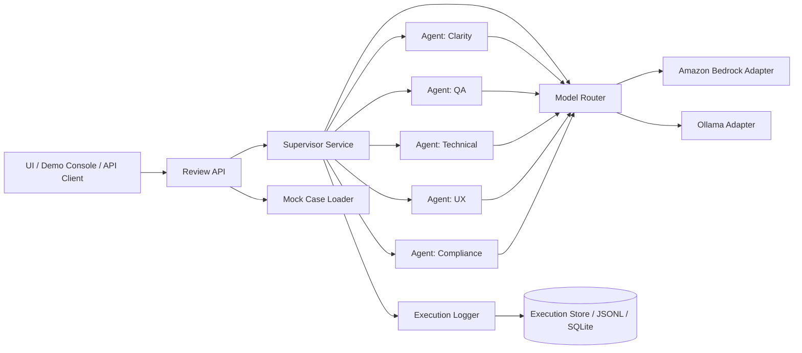
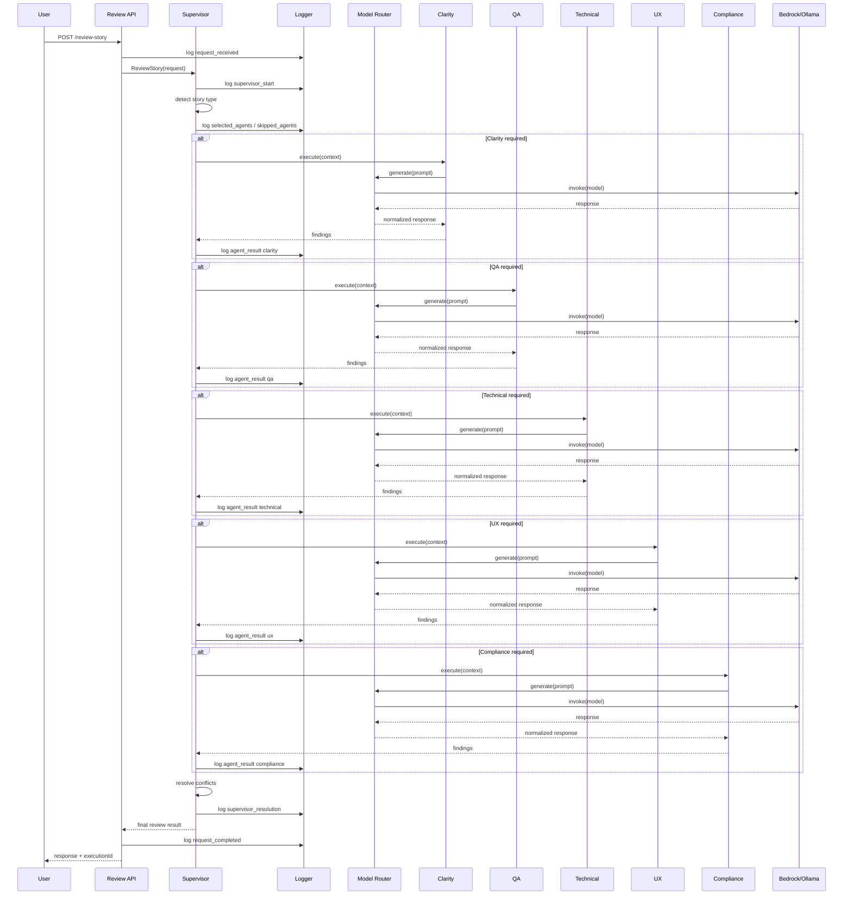

# Technical Architecture
## Multi-Agent POC for User Story and Requirements Review

## 1. General overview

The architecture is based on a **central supervisor**, several **specialized agents**, an **LLM provider abstraction** layer, and an **observability/logging** module.

The goal is to allow a single execution to use **Amazon Bedrock** or **Ollama** without changing the business logic or the contract between supervisor and agents.

---

## 2. Design principles

- **Specialization**: each agent addresses a different dimension.
- **Dynamic selection**: not all agents are executed every time.
- **Traceability**: every important decision is logged.
- **Provider abstraction**: Bedrock and Ollama share an interface.
- **Structured output**: each agent responds in controlled JSON.
- **POC simplicity**: clear architecture, without unnecessary complexity.

---

## 3. Component diagram



---

## 4. Main components

## 4.1 UI / Demo Console
Can be:

- a console;
- a simple web page;
- an endpoint consumed with Postman.

Responsibilities:
- enter story;
- choose provider and model;
- trigger execution;
- view result;
- view log.

---

## 4.2 Review API
Exposes endpoints for:

- reviewing a story;
- querying results;
- querying logs;
- running mock cases.

Contains no analytical logic; only orchestrates input/output and delegates to the supervisor.

---

## 4.3 Supervisor Service
The main business component.

Responsibilities:

- inspect the story;
- infer categories;
- decide which agents to invoke;
- pass shared context;
- compare outputs;
- resolve tensions;
- build the final response;
- emit logging events.

---

## 4.4 Specialized agents
Each agent is an autonomous component that:

- receives normalized input;
- generates contextual prompt;
- invokes the chosen LLM provider;
- returns structured output;
- records messages and results.

Planned agents:
- ClarityAgent
- QaAgent
- TechnicalAgent
- UxAgent
- ComplianceAgent

---

## 4.5 Model Router
Abstracts provider/model selection.

Responsibilities:
- receive execution configuration;
- resolve whether to use Bedrock or Ollama;
- instantiate the corresponding client;
- normalize request/response.

### Conceptual contract

```text
Supervisor/Agent -> ModelRouter -> ProviderAdapter -> LLM
```

---

## 4.6 Amazon Bedrock Adapter
Encapsulates communication with Bedrock.

Responsibilities:
- use AWS credentials/region;
- invoke the configured model;
- map request/response to internal format;
- report times and errors.

Typical configuration fields:
- provider = bedrock
- region
- modelId
- temperature
- maxTokens

---

## 4.7 Ollama Adapter
Encapsulates communication with the local Ollama runtime.

Responsibilities:
- call the local endpoint;
- send prompt and parameters;
- receive and normalize the output;
- report times and errors.

Typical configuration fields:
- provider = ollama
- endpoint
- model
- temperature
- numPredict

---

## 4.8 Execution Logger
Records the complete execution sequence.

Must be able to persist events such as:
- request received;
- supervisor decision;
- agent invoked;
- prompt emitted;
- response received;
- agent skipped;
- conflict detected;
- final consolidation.

For a POC it can be persisted in:
- JSONL files;
- SQLite;
- memory + file export.

---

## 4.9 Mock Case Loader
Allows loading predefined stories for demo.

Responsibilities:
- expose list of cases;
- return a story's text;
- suggest expected agents;
- facilitate repeatable demos.

---

## 5. Sequence flow



---

## 6. Agent selection

Selection must be done before invoking models to optimize cost and clarity.

### Signals the supervisor can use

- presence of UI verbs:
  - show,
  - screen,
  - button,
  - form,
  - profile;
- presence of technical terms:
  - retry,
  - scheduler,
  - queue,
  - integration,
  - notification,
  - persistence;
- presence of sensitive data:
  - personal data,
  - document,
  - report,
  - transactions,
  - audit;
- low complexity:
  - text change,
  - rename label,
  - adjust copy.

---

## 7. Model strategy

## 7.1 Recommended simple mode
One execution uses a single provider and a single model.

Advantages:
- easy to explain;
- simpler to implement;
- more comparable results.

## 7.2 Future mode
Allow per-agent override.

Examples:
- clarity and UX on Ollama;
- compliance on Bedrock;
- QA on a different model.

This is not necessary for the first version of the POC, but the architecture must make it possible.

---

## 8. Internal contracts

## 8.1 ReviewRequest

```json
{
  "storyId": "story-001",
  "title": "Reset password",
  "storyText": "As a user, I want to be able to reset my password from the login screen to recover access to my account.",
  "provider": {
    "type": "bedrock",
    "model": "example-model",
    "region": "us-east-1",
    "temperature": 0.2
  },
  "logging": {
    "level": "full",
    "includePrompts": true,
    "includeResponses": true
  }
}
```

## 8.2 AgentResult

```json
{
  "agent": "qa",
  "status": "ok",
  "score": 0.82,
  "issues": [
    "Error scenarios are missing",
    "Link expiration is not defined"
  ],
  "recommendations": [
    "Add Given/When/Then",
    "Define behavior for non-existent email"
  ],
  "rawSummary": "The story is partially testable"
}
```

## 8.3 FinalReviewResult

```json
{
  "executionId": "exec-2026-001",
  "status": "yellow",
  "provider": "bedrock",
  "model": "example-model",
  "invokedAgents": ["clarity", "qa", "ux"],
  "skippedAgents": [
    { "agent": "technical", "reason": "No relevant technical impact detected" },
    { "agent": "compliance", "reason": "No sensitive data detected" }
  ],
  "issues": [
    "Behavior for non-existent email is not defined",
    "Acceptance criteria are missing",
    "Link expiration is not clarified"
  ],
  "conflicts": [],
  "recommendations": [
    "Add acceptance criteria",
    "Define link expiration",
    "Use a generic message for security"
  ]
}
```

---

## 9. Logging and observability

## 9.1 Event types

- `request_received`
- `supervisor_started`
- `selected_agents`
- `skipped_agent`
- `agent_prompt_sent`
- `agent_response_received`
- `agent_result_parsed`
- `conflict_detected`
- `supervisor_resolution`
- `final_result_generated`
- `request_completed`

## 9.2 Log line example

```json
{
  "timestamp": "2026-04-20T10:15:31Z",
  "executionId": "exec-001",
  "eventType": "selected_agents",
  "data": {
    "invoked": ["clarity", "qa", "ux"],
    "skipped": [
      {
        "agent": "compliance",
        "reason": "No sensitive data signals found"
      }
    ]
  }
}
```

## 9.3 Suggested demo view

- left panel: story;
- center panel: supervisor decisions;
- right panel: event timeline;
- final block: consolidated result.

---

## 10. Error handling

### Cases to consider

- LLM provider timeout;
- unparseable response;
- agent returns incomplete JSON;
- Bedrock unavailable;
- local Ollama not responding.

### POC strategy

- simple optional retry;
- if an agent fails, log the error;
- allow the supervisor to continue with the rest;
- mark the final result as partial if important information is missing.

---

## 11. Security and privacy

For the POC, define whether the full prompt or a summarized version is logged.

### Recommendation
Have three logging levels:

- `basic`: decisions and times;
- `standard`: decisions + summarized results;
- `full`: complete prompts and responses.

This allows a rich demo without forcing the same behavior in a more sensitive scenario.

---

## 12. Storage

For a few-day POC, the simplest option is:

- store executions in JSONL files;
- store final results as JSON;
- store mock cases as `.json` files.

Lightweight alternative:
- SQLite for fast queries by `executionId`.

---

## 13. Suggested deployment

## Option A: Local demo
- simple UI or console;
- local Ollama;
- JSONL files for logging.

## Option B: Hybrid demo
- same local application;
- Bedrock as remote provider;
- local logging.

## Option C: Lightweight cloud demo
- deployed API;
- configurable provider;
- log storage in lightweight database.

---

## 14. Future evolution

- integration with Jira/Azure DevOps;
- historical memory per project;
- aggregated story quality score;
- Bedrock vs Ollama comparison on the same case;
- dashboards of most frequent findings;
- automatic suggestion of corrected story text.

---

## 15. Final technical recommendation for the POC

For a convincing demo in a few days:

- implement 5 well-defined agents;
- support 2 providers:
  - Bedrock,
  - Ollama;
- store logs in JSONL;
- expose 4 or 5 mock cases ready to run;
- visually show:
  - who was invoked,
  - who was skipped,
  - what the supervisor decided,
  - how tensions were resolved.
